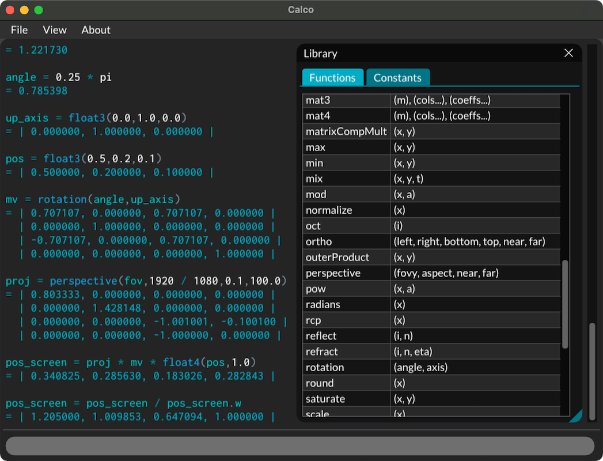
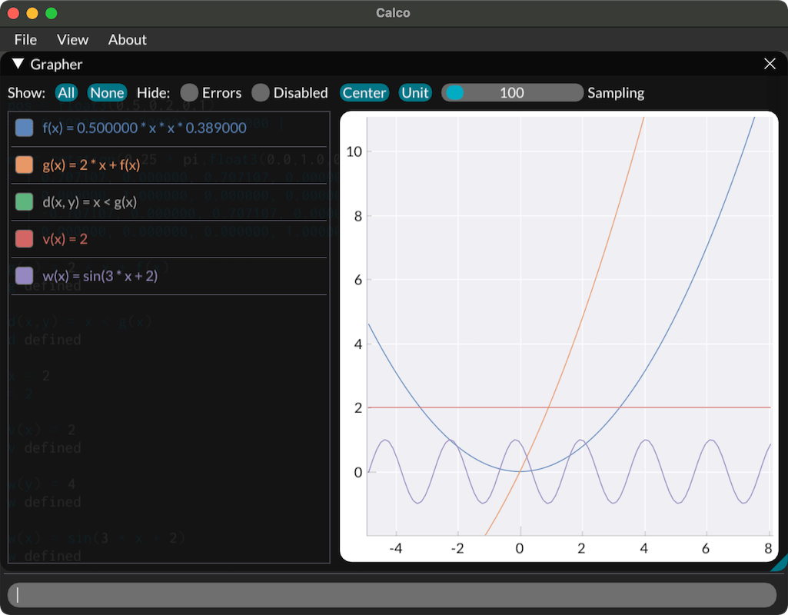
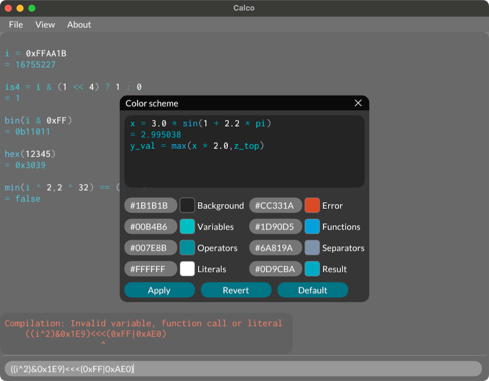

# Calco

Calco is a text-based calculator and grapher. Its syntax is loosely based on C and shader languages (GLSG, HLSL).

## Features

* Floats: variables and function definitions, standard functions and constants library
* Integers: bit shifts and masks, declaration and display in hexadecimal, binary,...
* Vectors and matrices: up to 4x4, dot and cross products, matrix-vectors operations, both GLSL and HLSL syntaxes are supported
* Booleans expressions and ternary operator
* Graphics-related functions: interpolation, reflection and refraction, transformation matrices, orthographic and perspective projections,... 
* Graphing tool for 1D functions with additional parameters exposed as sliders
* Complete command history, listing of defined variables and functions
* On-the-fly evaluation and validation
* Customizable color schemes

## Future improvements

* Implicit integer to float casting
* Extended precision
* Search in functions/variables/built-ins lists
* Fix 2D domain sampling
* Random function

